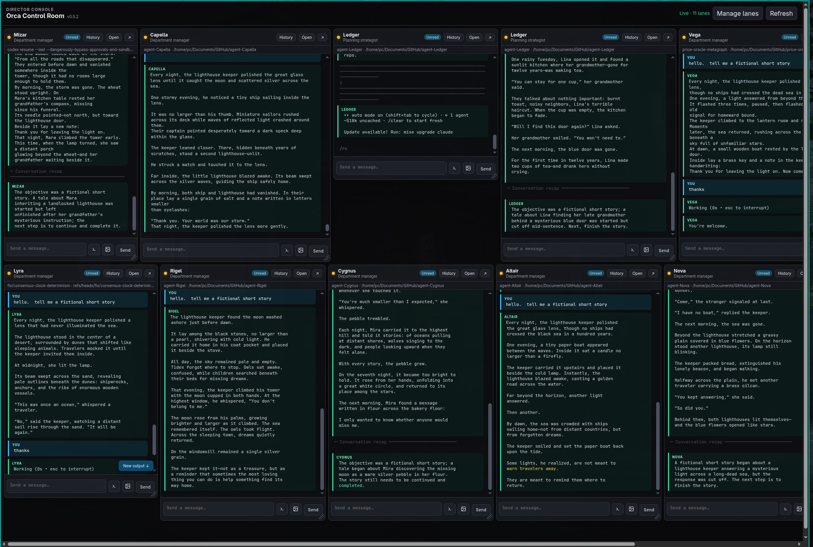
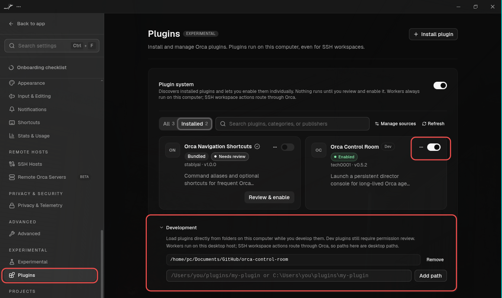
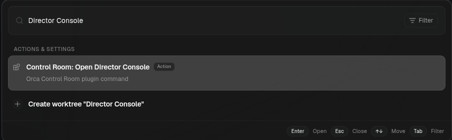

# Orca Control Room

A persistent director console for people running a long-lived organization of agents in
[Orca](https://www.onorca.dev/).

Unlike a task dashboard, Control Room keeps planning strategists and department managers visible
even when they are idle. Short-lived workers roll up beneath their manager instead of taking over
the primary view.



## Current prototype

- Runs alongside stock Orca and uses only the public `orca` CLI.
- Pins a stable roster across Orca restarts, rebinding runtime terminal handles automatically.
- Re-reads every selected terminal's rendered screen every two seconds and rolls changed
  frames into a bounded lane history.
- Adds terminal-style highlighting to the plain-text terminal data exposed by Orca's public CLI.
- Groups prompts, replies, tool activity, and thinking into labeled conversation blocks.
- Restores paragraph breaks that Orca's rendered-screen projection omits by aligning the live
  screen with its accumulated terminal transcript.
- Filters Codex permission dialogs, usage notices, idle prompts, and other terminal-interface noise
  out of the conversation view and retained lane history.
- Replaces animated thinking redraws in place instead of repeating them in lane history.
- Preserves the last readable frame during transient failures and flags the lane while retrying.
- Keeps a bounded rolling lane history so short post-send frames cannot collapse the scrollbar.
- Preserves reading position and offers a **New output** jump when a lane changes above the fold.
- Opens retained terminal history on demand.
- Waits for Orca's verified agent-prompt delivery result and displays failures without clearing
  the Control Room input.
- Supports multiline prompts and pasted snippets: Enter sends, while Shift+Enter inserts a line.
- Offers an explicit per-lane **Keys** mode that passes typing, pasted commands, arrows, Enter,
  Escape, Tab, Backspace, and navigation keys directly to the terminal through Orca's public CLI.
  This makes slash-command menus and other interactive terminal prompts usable without leaving
  Control Room.
- Focuses a lane's compact composer when its conversation area is clicked, while preserving text
  selection in the transcript.
- Previews clipboard or file-picker images and sends their private local paths with the prompt.
- Sends a message or jumps directly to the native Orca terminal.
- Persists lane names, strategist/manager roles, order, and column count.
- Supports persistent per-lane resizing without changing the underlying PTY dimensions.
- Binds only to `127.0.0.1` and protects its local API with a random session token.
- Replaces an outdated companion automatically when a newer plugin version opens.

## Install

1. Clone or download this repository to the computer running Orca. For example:

   ```bash
   git clone https://github.com/Tech0001/orca-control-room.git
   ```

2. In Orca, open **Settings → Plugins** and turn on the experimental **Plugin system**.
3. Expand **Development**, enter the absolute path to the cloned `orca-control-room` folder, and
   select **Add path**.

   

4. Review the requested permissions and enable **Orca Control Room**.
5. Open **Search** (`Ctrl+J` on Linux), search for **Director Console**, and run
   **Control Room: Open Director Console**.

   

6. Choose **Manage lanes**, add the long-lived terminals, assign roles, and save the layout.

> [!IMPORTANT]
> Control Room includes a local Node worker that launches its companion process. Orca workers run
> as normal processes on your computer, so review the repository before enabling it.

## Launch Control Room

Open Orca's **Search** (`Ctrl+J` on Linux), search for **Director Console**, and run
**Control Room: Open Director Console**. The current plugin does not add a permanent sidebar icon
or toolbar button.

To update, pull the latest repository changes, close the Control Room window, toggle the plugin off
and back on, and open the command again. The active version is displayed beside
**Orca Control Room** in the header.

## Share the plugin

Control Room appears as one item in Orca, but the plugin itself is this entire repository folder.
To share it, publish or archive the complete `orca-control-room` folder. The recipient can clone or
extract it, then follow the installation steps above. It has no third-party npm
dependencies to install.

Each person's pinned lanes, roles, layout, and runtime session are kept outside the repository in
their own `~/.config/orca-control-room` directory. Sharing the plugin therefore does not share your
local agent roster or Control Room state.

## Local operation and images

On Linux, the launcher opens Chromium in app mode when available and falls back to the default
browser. The companion exits after ten minutes without an open client.

Pasted images are written with user-only permissions under
`/tmp/orca-control-room-attachments`, then expired after 24 hours. They stay on this computer
unless the receiving agent explicitly uploads them somewhere.

**Keys** mode directly controls the selected terminal and can therefore run commands. Its blue
active state is deliberately separate from normal message delivery; switch it off to return to
agent prompts and image attachments.

## Run without installing the plugin

```bash
npm start
```

Then open `http://127.0.0.1:47831/?token=development-only-token`.

## Validate

```bash
npm test
```

## Status

This is an early local prototype. It intentionally avoids Orca's private terminal stream protocol
so it remains compatible with stock app updates. The tradeoff is a readable text representation
of each terminal rather than embedding Orca's exact native xterm component.
